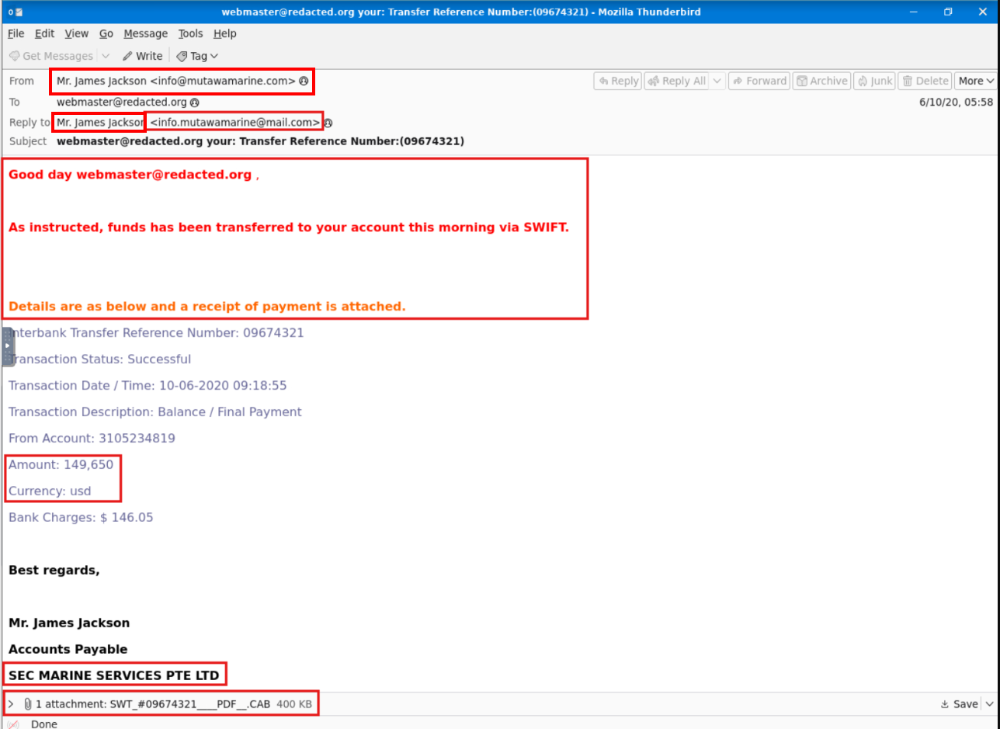
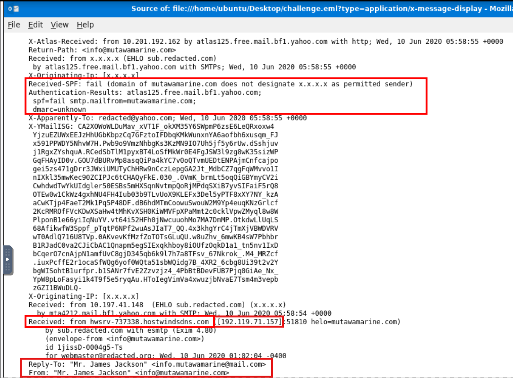
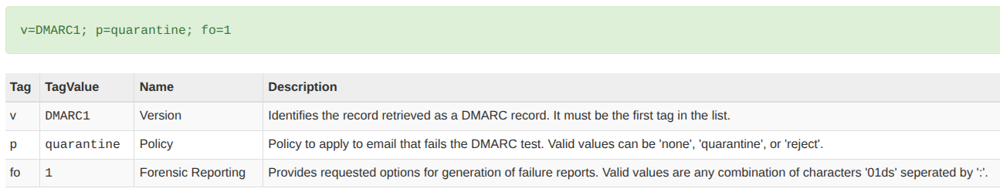
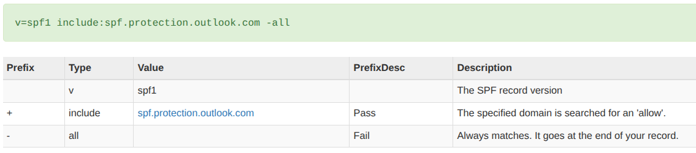
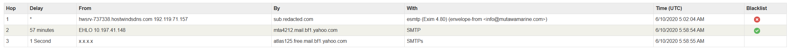
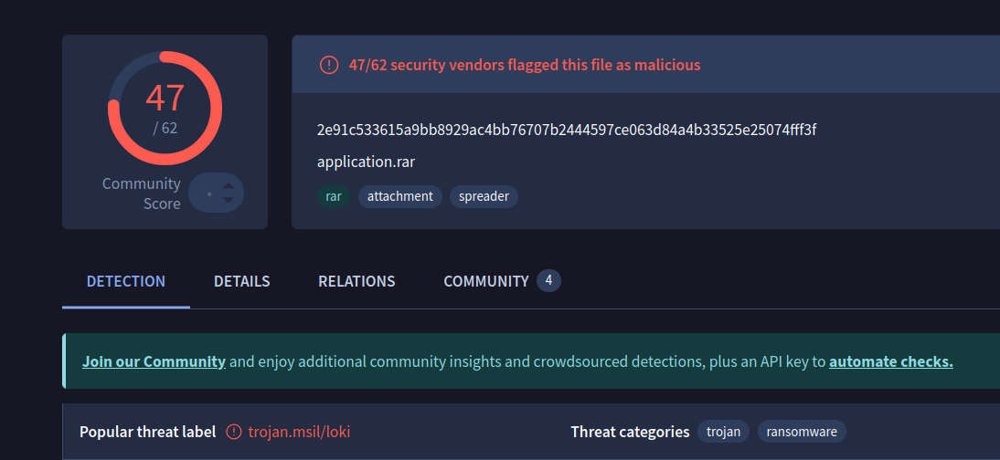

# Phishing Demonstration with Mxtoolbox 
Author: Cody Keppen

Date: 1/13/2026

# Table of Contents
- [Summary of exercise](#summary-of-exercise)
- [MITRE ATT&CK TTPs in exercise](#mitre-attck-ttps-in-exercise)
- [Tools/concepts used](#toolsconcepts-used)
- [Investigation steps](#investigation-steps)
- [Technical Analysis](#technical-analysis)
- [Remediation Steps](#remediation-steps)
- [Lessons Learned](#lessons-learned)
- [Resources](#resources)

---

# Summary of exercise

Source: TryHackMe [The Greenholt Phish](https://tryhackme.com/room/phishingemails5fgjlzxc) module.

This investigation analyzes a phishing attempt that targeted a sales executive via a spoofed email account of a known vendor. The attack utilized a malicious `.rar` attachment and social engineering to attempt an unauthorized financial transfer. Analysis focuses on header validation, DMARC, SPF and DKIM protocols, and artifact extraction to identify TTPs.
#  MITRE ATT&CK TTPs in exercise

| ID                                                          | Tactic              | Technique                                            | Procedure                                             |
| :---------------------------------------------------------- | :------------------ | :--------------------------------------------------- | :---------------------------------------------------- |
| [T1591.002](https://attack.mitre.org/techniques/T1591/)     | Reconnaissance      | Gather Victim Org Information: Business Relationship | Use of third party vendors to deceive users           |
| [T1566.001](https://attack.mitre.org/techniques/T1566/001/) | Initial Access      | Phishing: Spearfishing Attachment                    | Trojan embedded in an email targeting Sales           |
| [T1204.002](https://attack.mitre.org/techniques/T1204/002/) | Execution           | User Execution: Malicious File                       | Malicious file attached to phishing email             |
| [T1672](https://attack.mitre.org/techniques/T1672/)         | Defense Evasion     | Email Spoofting                                      | Deceptive header manipulation                         |
| [T1036.002](https://attack.mitre.org/techniques/T1036/002/) | Defense Evasion     | Masquerading: Right-to-Left Override                 | Use of multiple file types in file name for deception |
| [T1071.001](https://attack.mitre.org/techniques/T1071/001/) | Command and Control | Application Layer Protocol: Web Protocols            | `.com` embedded in the `.rar` file attached to email  |
| [T1657](https://attack.mitre.org/techniques/T1657/)         | Impact              | Financial Theft                                      | Gain access from sales executive                      |

---

# Tools/concepts used
1. **Mxtoolbox**: static email header analysis
2. **VirusTotal**: hash analysis

# Investigation steps

The sales team of Greenholt PLC reported an unusual email from a regular business partner that did not match past communications. Fortunately the member of the team had enough phishing knowledge to understand this was worth reporting. Which included poor formatting, odd communication behavior and a random attachment.

With the email saved to desktop, Thunderbird was used to review the email. Screenshot with highlights provided.

Initial review, formatting doesn't look very professional from the start. Standard currency formatting is not used.

The sender is `Mr. James Jackson` with an email address of `info[@]mutawamarine[.]com`, with no reference to `James Jackson`.

The reply-to email address , `info[.]mutawamarine[@]mail[.]com`, uses a different domain. This is an attempt to spoof the `[@]mutawamarine[.]com` domain with the sender email, redirecting all replies go to the free webmail domain of `[@]mail[.]com`.

A discrepancy is found between the spoofed email address domain and the signature line company, `SEC Marine Services PTE LTD`.

There is an attachment found with the file name of `SWT_#09674321___PDF__.CAB`. Initial impression is this is an attempt to confuse the user on the file type by adding `PDF` and `CAB` to the file name. This is referred to as `Right to Left Override` (RTO).

Looking at the raw source data of the email, a sender IP is found, `192[.]119[.]71[.]157` using a `Hostwindsdns[.]com` domain.

`SPF` has a fail trigger since this is sent from the `Hostwindsdns` domain and not `mutawamarine[.]com`.  

`Received-SPF: fail (domain of mutawamarine[.]com does not designate x.x.x.x as permitted sender)`. 

DMARC is shown as unknown here.

Using Mxtoolbox to gather more information the following [results](https://mxtoolbox.com/Public/Tools/EmailHeaders.aspx?huid=c69dac0a-7bee-4869-bd9a-777180e9841c) are from pasting the header into the Header Analyzer.

DMARC for `mutawamarine[.]com` is `v=DMARC1; p=quarantine; fo=1`. Meaning the email should have gone to the spam folder of the user, which should be verified.

Further SPF information for `mutawamarine[.]com` shows SPF set as,

`v=spf1 include: spf.protection.outlook.com -all`. 

Indicating only Outlook should be able to send these emails and fail all others. Though DMARC's quarantine setting will override SPF.

The sender IP, `192[.]119[.]71[.]157` is on a [blacklist](https://mxtoolbox.com/SuperTool.aspx?action=blacklist%3a192.119.71.157&run=emailheaders) for spam incidents. Providing screenshot to confirm origination of email is from `hostwindsdns[.]com` and not `mutawamarine[.]com`.

I saved the attachment (`SWT_#09674321___PDF__.CAB`) on a virtual machine to retrieve the hash, 

`2e91c533615a9bb8929ac4bb76707b2444597ce063d84a4b33525e25074fff3f`

Using VirusTotal to research the hash, [results](https://www.virustotal.com/gui/file/2e91c533615a9bb8929ac4bb76707b2444597ce063d84a4b33525e25074fff3f/detection) show multiple malicious flags of Trojan activity. The file is also confirmed to be a `.rar`, not a `.pdf` or `.cab` as the file name tries to convey.

When looking at the "Relations" tab of  I can see a "Bundles Files" with a `WIN32 EXE` file type of `SWT_#09674321__PDF[.]com`, which I haven't detected.

Unfortunately, the TryHackMe VM had some limitations with unzip tools. Below I had to do my best to find the files inside the `.rar` file.

I attempt to extract any files using`7z x SWT_#09674321___PDF__.CAB`, which gives me an error for `.cab`, when it's really a `.rar`. 

In an attempt to help the program, I change the file name to `malware_check.rar`, so it knows it's a `.rar`file type to not be confused with the other formats in the file name. 

With `7z x malware_check.rar` I do get the `SWT_#09674321__PDF[.]com` extracted. But when I get the hash, it's the known 0-byte hash,

`e3b0c44298fc1c149afbf4c8996fb92427ae41e4649b934ca495991b7852b855`

Regardless, the existence of this file is confirmed. With it being a `[.]com`,  the file is executable and will attempt a connection when opened.

---

# Technical Analysis

This looks to be a phishing campaign targeting the sales team using a known business partner. Further details below.

## Email header display

Threat actors tried to deceive users with a spoofed domain email from their vendor Mutawamarine, while using a different reply-to domain. Only the "From" is displayed to the user. "Reply-to" is where the reply of that email will go to.

From: `Mr James Jackson <info[@]mutawamarine[.]com>`, domain: `[@]mutawamarine[.]com`
Reply-to: `info[.]mutawamarine[@]mail[.]com`, domain: `[@]mail[.]com`

This is an indicator of Business Email Compromise (BEC).

## DMARC - SPF/DKIM

SPF shows a fail flag for the email, as `mutawamarine[.]com` should only be sent with Microsoft Outlook IPs. With the email originated from a Hostwinds server, a   Hard fail in the code, `-all`, is triggered.

`v=spf1 include: spf.protection.outlook.com -all`.

Unfortunately, DKIM was not setup as an additional check with a digital signature. This is the process of a sending server creating a hash from the email, then encrypting the hash with a private key that is then attached to the email header. When a receiving server sees this DKIM signature, it will retrieve the public key from the DNS records of the domain. Using the public and private keys, to decrypt and authenticate the sender.

DMARC policy uses SPF and DKIM flags to act and overrides the flags of those two protocols. DMARC for the `[@]mutawamarine[.]com` domain is managed by Mutawamarine. The settings are set to send flagged emails, from SPF and DKIM, to spam folders instead of outright rejecting them. Most likely to avoid false positives. 

`v=DMARC1; p=quarantine; fo=1`

Confirmation is needed to verify this email was found in the spam folder and not the users Inbox. If user decided to act on an email in the spam folder, security training should be assigned to the user. If the email was found in the inbox of the user, then further investigation should occur to test email filters.

## Attachment file type

Threat actors tried to alter the file name of the attachment to trick users into thinking the file is a PDF, `SWT_#09674321___PDF__.CAB`. The file ended up not being a `.cab` file. Which can be used to trick monitoring services.

It was a zipped file `.rar` file with a `.com` file embedded in it. 

The reason for using a `.com` file is to go under the radar of monitoring systems looking for `.exe` files. Allowing for the Trojan to  communicate with a C2 server, most likely the IP of the sender using the Hostwinds server.

---

# Remediation Steps
1. Block the IP of the sender, `192[.]119[.]71[.]157`
2. Scan and purge the mail server for the hashes of the `.rar` and `.com` files
3. Run endpoint scans for the hashes of the `.rar` and `.com` files
4. Review monitoring systems for `.com` file detection
5. Confirm if email was found in Spam or Inbox
6. Perform targeted company training for users who downloaded files
7. Contact business partners IT team to provide information on phishing campaign. Possible leading to DMARC and DKIM setting changes

# Lessons Learned

- Mxtoolbox is a great quick tool to review headers and understand the DMARC/SPF/DKIM settings for a domain.
- There is a specific known hash to quickly tell a user that they are looking at a 0-byte hash
- Got a better understanding of the relationship of DMARC with SPF and DKIM
- How spoofed emails and reply-to settings play into the playbook of threat actors for deception
- Though this was from a THM module, still good to think in real world scenario to double check if the email was found in the spam folder or the inbox

---

# Resources
- Scenario from: [The Greenholt Phish](https://tryhackme.com/room/phishingemails5fgjlzxc) exercise on TryHackMe
- https://attack.mitre.org/

